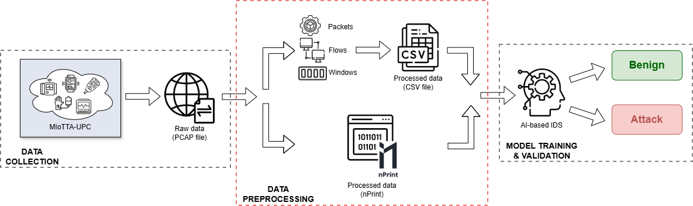

# MIOTTA-NPT: Network Traffic Analysis Tool for IoMT and IoT Research



## 🔍 Overview

**MIOTTA-NPT** is a network traffic preprocessing tool designed to streamline the analysis of `.pcap` files. It allows for the extraction of statistics in `.csv` format based on:
- Individual packet metrics
- Grouping by **windows** of configurable size
- Grouping by **flows** (TCP/UDP)
- **Raw packet** representations using the [nPrint](https://github.com/nprint/nprint) standard

This repository is intended for researchers working on Intrusion Detection Systems (IDS), network machine learning, and traffic analysis in **IoT/IoMT** environments.

---

## ⚙️ Installation

### General Requirements

- Python 3.10+
- `tshark` version 4.0.0 or later (Wireshark CLI; tested with 4.2.2)
- `nPrint` compilation (modified for ARP support; needs `g++`, `make` and `libpcap-dev`) — only for `nprint` mode

### Installing Dependencies

```bash
pip install -r requirements.txt
```

pandas 3 is not supported yet (`requirements.txt` keeps `pandas<3`). Tested with Python 3.12, pandas 2.3.2, numpy 2.3.2, scipy 1.16.2, dpkt 1.9.8 and PyYAML 6.0.3.

### Compiling nPrint (Run Once)

```bash
cd nprint
make
```

## 🚀 Quick Start

```bash
python3 miotta_npt.py file1.pcap file2.pcap --config config/example_config.yaml
```

The tool can be launched from any directory (e.g. `python3 /path/to/miotta_npt.py capture.pcap --config my_config.yaml`). Results are written directly into `output_dir` (relative paths are relative to the directory you launch it from).

### Reproducing the published datasets

The features of the datasets published with this tool (CICIoMT2024 and IoMT-TrafficData unified dataset, DOI [10.34810/DATA3305](https://doi.org/10.34810/DATA3305); HospNet26, DOI [10.34810/DATA3050](https://doi.org/10.34810/DATA3050)) were extracted with `config/iomt_ids_window100.yaml` (`classic` mode, `combinada`, windows of 100 packets):

```bash
python3 miotta_npt.py capture.pcap --config config/iomt_ids_window100.yaml
```

## 🛠️ YAML Configuration File

Basic example (`config/example_config.yaml`):

```yaml
mode: "nprint"              # or "classic"
output_dir: "./output"

classic:
  mode: all                 # Analysis type: paquetes (packets), ventana (windows), flujos (flows), combinada (windows + flows), all
  size_of_window: 10        # Number of packets per window

nprint:
  headers: [ethernet, ipv4, ipv6, absolute_time, icmp, tcp, udp, relative_time, arp]    # Protocol headers included in the output
  masks: [ethernet, arp, ipv4, ipv6, tcp, udp, ip, icmp]                                # Headers from which to remove location information
```

## 📂 Generated Outputs

Depending on the method selected, CSV files are generated in the `output_dir` of the configuration (`./output` in the examples).

### Statistical Analysis (`preprocessing_tool.py`)
- `paquetes_*.csv`: complete network traffic
- `estadisticas_ventanas_*.csv`: grouped by windows
- `estadisticas_flujo_*.csv`: grouped by flow
- `estadisticas_combinadas_*.csv`: combination of both (windows and flows)

### nPrint Analysis (`preprocessing_tool_nprint.py`)
- `<pcap file name>.csv`: raw representation of binary headers

## 📁 Repository Structure

```bash
miotta-npt/
├── miotta_npt.py                 # Main script
├── preprocessing_tool.py         # Statistical processing
├── preprocessing_tool_nprint.py  # Processing with nPrint
├── config/
│   ├── example_config.yaml
│   └── iomt_ids_window100.yaml   # configuration of the published datasets
├── output/
├── nprint/
│   └── (sources + Makefile)
├── requirements.txt
├── LICENSE
└── README.md
```

## 📜 License

This project is available under the MIT License (see [LICENSE](LICENSE)). The modified nPrint code in `nprint/` keeps its original Apache 2.0 license (`nprint/LICENSE`, `nprint/NOTICE`).


